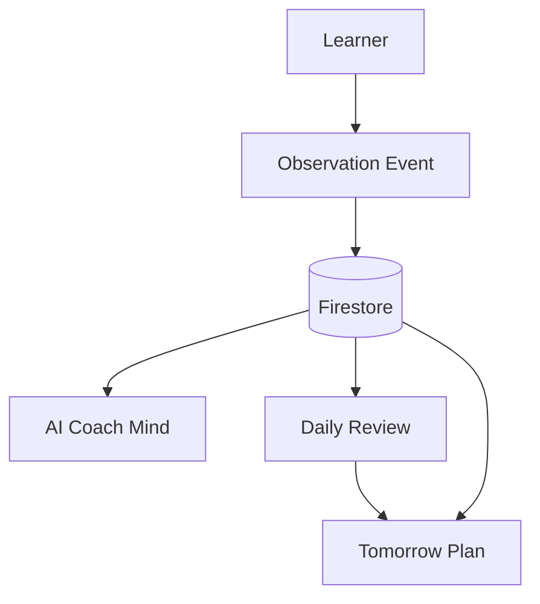

# MentorHQ

MentorHQ is an observation-centered AI learning architecture.
The system stores learner-facing facts as `Observation Event`s, saves them to Firestore, and regenerates AI thoughts from those facts whenever needed.

## Architecture



### End-to-End Flow

1. The learner answers each statement.
2. MentorHQ converts that interaction into an `Observation Event`.
3. The observation is saved to Firestore as factual history.
4. AI Coach Mind reads saved observations and regenerates `Reading`, `Memory`, `Pattern`, and `Review`.
5. Daily Review reads observations plus session memory and generates a daily summary.
6. Tomorrow Plan reads Daily Review, observations, and session memory and generates the next-day plan.

### What Is Persistent

- `observation_events` are the canonical persistent fact layer for learner progress.
- `daily_reviews` and `tomorrow_plans` are also persisted, but they are generated artifacts.
- Live Thought Stream is not persisted.
- AI thoughts are regenerated from saved observations instead of stored as long-lived assets.

## Observation First Design

MentorHQ separates:

- `Observation = Fact`
- `AI Coach Mind = Hypothesis`

The system stores learner-side facts such as:

- answer choice
- correctness
- learner question history when it actually exists
- other observed session facts

The system does not persist AI thought turns such as:

- `Reading`
- `Memory`
- `Pattern`
- `Review`

Those thought layers are regenerated from saved observations each time Gemini is called.

### Why This Design

- Model improvements should immediately affect newly generated thoughts.
- Prompt improvements should immediately affect newly generated thoughts.
- AI output is not treated as the durable asset.
- Facts remain valuable even if the model changes years later.

In short:

- persist facts
- regenerate thoughts

## AI Design

### AI Coach Mind

AI Coach Mind is the runtime layer that reads observation history and generates four short internal turns:

- `Reading`: what happened this time
- `Memory`: what changed from previous observations
- `Pattern`: what kind of learner this may be
- `Review`: what to carry forward for review

These turns are generated by Gemini through `/api/coach-mind`.

Important constraints in the current implementation:

- unobserved absence is not treated as evidence
- missing chat is not described as "no chat happened"
- missing reason input is not described as "the learner gave no reason"
- `Pattern` updates learner model only; it should not analyze the current legal topic or statement itself

### Live Thought Stream

Live Thought Stream is not stored in Firestore.

Current runtime behavior:

1. React loads the latest daily session from `/api/daily-session/latest`.
2. That API reads saved `observation_events` for the session.
3. React syncs them into `observations` state.
4. For each observation, the client calls `/api/coach-mind`.
5. Gemini regenerates `Reading`, `Memory`, `Pattern`, and `Review`.

That means Live Thought Stream is regeneration, not cache.

If the page is reloaded:

- observations can be reloaded from Firestore
- thought turns are recomputed from those observations
- previously generated thought text is not restored from DB

## Data Flow

### Learner to Observation

The learner interacts with statement-level questions.
Each meaningful step is converted into an `Observation Event`, including:

- `question_id`
- `question_index`
- `statement_index`
- `learner_choice`
- `correct_or_wrong`
- `observation_note`
- `note`

When incorrect-answer chat exists, the transcript is stored as factual note content and can later be read by AI Coach Mind.

### Observation to Live Thought Stream

`/api/coach-mind` does not query Firestore directly.
It receives:

- `latestObservation`
- `recentObservations`
- `existingThoughts`

from the client.

Those values come from React state, but that state is hydrated from API responses that themselves read persisted `observation_events`.

### Observation to Daily Review

Daily Review generation reads:

- `observation_events`
- `sessions`-based memory summary

It then generates a review and stores only the generated review result.

### Observation to Tomorrow Plan

Tomorrow Plan generation reads:

- `daily_reviews`
- `observation_events`
- `sessions`-based memory summary

It then generates a plan and stores the generated result.

## Firestore

The current implementation uses these collections:

### `sessions`

Stores deliberation-level session memory.

Main contents:

- `learnerCase`
- `deliberation_events`
- `coach_decision`
- `misunderstanding_type`
- `mode`
- `created_at`

This is used for memory context and repeated-pattern summary.

### `daily_sessions`

Stores the learner's daily practice session container.

Main contents:

- `question_ids`
- `current_index`
- `observation_count`
- `status`
- `review_status`
- `tomorrow_plan_status`
- `created_at`

### `observation_events`

Stores factual learner progress events.

Main contents:

- `daily_session_id`
- `question_id`
- `question_index`
- `statement_index`
- `learner_choice`
- `correct_or_wrong`
- `learner_reason`
- `reasoning_style`
- `intervention_type`
- `misunderstanding_type`
- `answer_signal_score`
- `observation_note`
- `note`
- `created_at`

This is the main fact source for Live Thought Stream, Daily Review, and Tomorrow Plan.

### `daily_reviews`

Stores generated daily review output.

Main contents:

- `daily_session_id`
- `summary`
- `key_observations`
- `repeated_patterns`
- `coach_comment`
- `created_at`

### `tomorrow_plans`

Stores generated next-day plan output.

Main contents:

- `daily_session_id`
- `daily_review_id`
- `focus_theme`
- `practice_items`
- `caution_points`
- `coach_message`
- `created_at`

## Storage Model

### Firestore

Primary persistent storage in production-style flow:

- `sessions`
- `daily_sessions`
- `observation_events`
- `daily_reviews`
- `tomorrow_plans`

### React Local State

Used for current UI/runtime state only.

Examples:

- `observations`
- `latestObservation`
- `coachMindTurns`
- `dailyReview`
- `tomorrowPlan`

This is not durable storage.

### localStorage

Not used in the current implementation.

### sessionStorage

Not used in the current implementation.

### Fallback Storage

If Firestore is unavailable, the server falls back to:

- in-memory maps
- JSON files under `/tmp`

Fallback files:

- `mentorhq-daily-sessions.json`
- `mentorhq-observation-events.json`
- `mentorhq-daily-reviews.json`
- `mentorhq-tomorrow-plans.json`

## What Is Recomputed vs Saved

### Saved

- observations
- daily session metadata
- deliberation session memory
- generated daily reviews
- generated tomorrow plans

### Recomputed

- Live Thought Stream
- `Reading`
- `Memory`
- `Pattern`
- `Review`

This is the core architecture choice:

- facts are stored
- thoughts are regenerated

## Run

```bash
npm install
cp .env.example .env.local
npm run dev
```

Open [http://localhost:3000](http://localhost:3000).

If Firestore credentials are unavailable, the app falls back to in-memory and `/tmp` storage.
