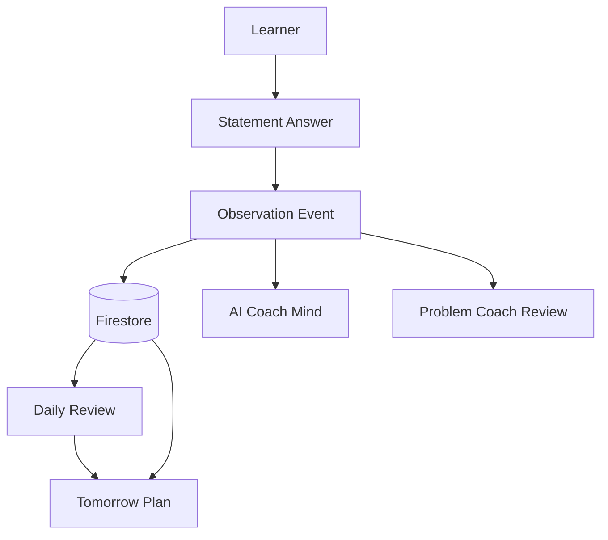

# MentorHQ

一人で学習を続ける中で、

「自分のことを理解してくれるマンツーマンメンターがいたら。」

そう思ったことはありませんか？

昨日はどこで迷ったのか。

何が理解できていて、何が苦手なのか。

そんなことまで理解したうえで、今日の学習、明日の学習まで導いてくれる存在。

MentorHQ は、答えを教える AI ではありません。

Observation を積み重ね、学習者モデルを育てながら、あなたに合った学習へ導く Learning OS です。

## What It Does

MentorHQ は、管理業務主任者試験の四択問題を題材にした学習体験です。

学習者は 1 問をいきなり解説されるのではなく、肢ごとに判断します。その判断は `Observation Event` として保存され、AI Coach Team が学習者の読み方、迷い方、理解の進み方を短い内部会話として更新します。

主な流れは次のとおりです。

1. 今日のセッションを開始する
2. 問題文を確認する
3. 肢ごとに `正しい / 誤り` を判断する
4. 判断結果を `Observation Event` として保存する
5. 回答直後に AI Coach Mind が `Reading` `Memory` `Pattern` `Review` を生成する
6. 不正解時は短い追加質問で理解を補助する
7. 4 肢の確認後に Final Answer を出す
8. Final Answer 後に 1 問全体の `Problem Coach Review` を生成する
9. 3 問完了後に `Daily Review` を生成する
10. Daily Review から `Tomorrow Plan` を生成する

## Core Idea

MentorHQ の中心は `Observation First` です。

- `Observation = Fact`
- `AI Coach Mind = Hypothesis`

保存するのは、学習者に実際に起きた観測事実です。

- どの肢をどう判断したか
- 正誤
- reasoning style
- misunderstanding type
- 実際に発生した追加質問
- Final Answer の結果

一方で、AI の思考ログそのものは永続保存しません。

- `Reading`
- `Memory`
- `Pattern`
- `Review`
- Problem-level Coach Review の turns

これらは React state 上で表示されるランタイム生成物です。Firestore の主な役割は、あとから再利用できる Fact source として Observation を保存することです。

## Learning Flow

### Statement Observation

各肢の回答は `Observation Event` に変換されます。

主に保存する情報は次のとおりです。

- `daily_session_id`
- `question_id`
- `question_index`
- `statement_index`
- `learner_choice`
- `correct_or_wrong`
- `reasoning_style`
- `misunderstanding_type`
- `answer_signal_score`
- `observation_note`
- `note`

不正解後の追加チャットがある場合は、実際のやり取りを `note` に保存します。チャットが存在しないことを「質問しなかった」とは扱いません。

### AI Coach Mind

肢ごとの回答直後、クライアントは optimistic observation を使って `/api/coach-mind` を呼びます。

Firestore 保存完了や再読み込みを待たず、右側の Live Thought Stream がすぐに動き始めます。これは回答直後の UX を優先するためです。

`/api/coach-mind` は次を受け取ります。

- `latestObservation`
- `recentObservations`
- `existingThoughts`

AI Coach Mind は Gemini で 4 turns を生成します。

- `Reading`: 今回の observation で実際に起きたことを見る
- `Memory`: 近い observation と比較する
- `Pattern`: 学習者モデルの仮説を慎重に更新する
- `Review`: 次に観察したいことを短く置く

表示は batch API の結果を React 側で段階的に reveal します。SSE や streaming API は使っていません。

### Problem Coach Review

Final Answer 後には、1 問全体の `Problem Coach Review` を生成します。

これは Daily Review ではありません。対象はその 1 問だけです。

`/api/coach-mind/problem-review` は次を受け取ります。

- その問題の Observation 全体
- latest observation
- Final Answer の結果
- 直近の Coach Mind turns

生成される turns は通常の Coach Mind と同じく `Reading` `Memory` `Pattern` `Review` です。

- `Reading`: 4 肢全体で実際に起きたこと
- `Memory`: 各肢 Observation の比較
- `Pattern`: 問題テーマ全体から見た理解モデル
- `Review`: 次に別テーマで確かめたいこと

Pattern は正答率の言い換えではなく、「何を理解し始めているか」を扱います。

### Daily Review

Daily Review は、1 日のセッション完了後に生成されます。

入力は主に次の情報です。

- `observation_events`
- `sessions` 由来の memory summary
- daily session metadata

Daily Review は Gemini で生成し、生成結果を `daily_reviews` に保存します。

保存する内容は次のとおりです。

- `summary`
- `key_observations`
- `repeated_patterns`
- `coach_comment`

### Tomorrow Plan

Tomorrow Plan は Daily Review 生成後に作成できます。

入力は主に次の情報です。

- `daily_reviews`
- `observation_events`
- `sessions` 由来の memory summary

Tomorrow Plan は Gemini で生成し、生成結果を `tomorrow_plans` に保存します。

保存する内容は次のとおりです。

- `focus_theme`
- `practice_items`
- `caution_points`
- `coach_message`

## Architecture



Firestore は学習事実の SSOT です。

ただし、右側に表示される AI Coach Mind は回答直後の optimistic observation から生成されます。Firestore 保存完了後に Observation は保存済み ID と同期されますが、Thought 自体は永続保存しません。

## Data Storage

### Firestore Collections

現在の実装で使用している主なコレクションです。

#### `daily_sessions`

1 日の学習セッション本体です。

- `question_ids`
- `current_index`
- `observation_count`
- `status`
- `review_status`
- `tomorrow_plan_status`
- `created_at`

#### `observation_events`

MentorHQ の中心となる Fact source です。

- `daily_session_id`
- `question_id`
- `question_index`
- `statement_index`
- `learner_choice`
- `correct_or_wrong`
- `learner_reason`
- `reasoning_style`
- `intervention_type`
- `misunderstanding_type`
- `answer_signal_score`
- `observation_note`
- `note`
- `created_at`

#### `daily_reviews`

生成済み Daily Review です。

- `daily_session_id`
- `summary`
- `key_observations`
- `repeated_patterns`
- `coach_comment`
- `created_at`

#### `tomorrow_plans`

生成済み Tomorrow Plan です。

- `daily_session_id`
- `daily_review_id`
- `focus_theme`
- `practice_items`
- `caution_points`
- `coach_message`
- `created_at`

#### `sessions`

旧 deliberation 経路の session memory として残っています。

- `learnerCase`
- `deliberation_events`
- `coach_decision`
- `misunderstanding_type`
- `mode`
- `created_at`

現行の daily practice の主経路は `daily_sessions` と `observation_events` です。

### React Local State

画面表示とランタイム制御に使います。

- `observations`
- `latestObservation`
- `coachMindTurns`
- `problemReviewTurns`
- `dailyReview`
- `tomorrowPlan`

これは永続保存ではありません。

### Fallback Storage

Firestore credential が無い場合、サーバー側では in-memory map と `/tmp` 配下の JSON にフォールバックします。

Fallback file:

- `mentorhq-daily-sessions.json`
- `mentorhq-observation-events.json`
- `mentorhq-daily-reviews.json`
- `mentorhq-tomorrow-plans.json`

この fallback は開発・デモ用です。永続性は Firestore より弱く、実行環境の再起動や `/tmp` の扱いに依存します。

## API Surface

### Current APIs

- `POST /api/daily-session/start`
  - 今日の daily session を開始します。

- `GET /api/daily-session/latest`
  - 最新の daily session と Observation を取得します。

- `POST /api/daily-session/observation`
  - statement 単位の Observation を保存します。

- `POST /api/daily-session/advance`
  - Final Answer 後に次の問題へ進めます。

- `POST /api/coach-mind`
  - 直近の Observation から肢ごとの AI Coach Mind を生成します。

- `POST /api/coach-mind/problem-review`
  - Final Answer 後に 1 問全体の Problem Coach Review を生成します。

- `POST /api/learner-chat`
  - 不正解後の短い追加チャットを生成します。

- `POST /api/daily-session/review`
  - セッション完了後に Daily Review を生成します。

- `POST /api/daily-session/tomorrow-plan`
  - Daily Review から Tomorrow Plan を生成します。

### Legacy / Experimental APIs

- `POST /api/deliberate`
  - 旧 Coach Decision / deliberation 実験用の経路です。
  - 現在の daily practice UI の主経路ではありません。

- `GET /api/sessions/latest`
  - 旧 session memory 参照用の補助 API です。

## Tech Stack

- Next.js 15
- React 19
- TypeScript
- Firebase Admin SDK / Firestore
- Gemini API
- Server-side fallback storage with in-memory maps and `/tmp` JSON files

## Run Locally

```bash
npm install
cp .env.example .env.local
npm run dev
```

Open [http://localhost:3000](http://localhost:3000).

`.env.local` can include:

```bash
GEMINI_API_KEY=your_api_key
GEMINI_MODEL=gemini-2.5-flash
FIRESTORE_PROJECT_ID=your_project_id
```

Firestore uses Google Application Default Credentials through Firebase Admin. If Firestore credentials are unavailable, MentorHQ falls back to in-memory and `/tmp` storage.

## Future Vision

MentorHQ の将来的な目標は、単に問題演習を支援することではなく、学習者の生活や状態まで含めて学習を最適化する Learning OS へ発展することです。

今後は、管理業務主任者試験以外の資格試験、受験、社内学習にも対応できる設計を目指します。試験日までの残り時間、進捗、理解度をもとに、必要な単元や復習優先度を調整し、合格見込みやリスクも学習者を追い込みすぎない距離感で伝える構想です。

さらに、カレンダーやスケジュールアプリと連携して仕事、家庭、学校の忙しさを推定したり、Fit 系ガジェットやヘルスデータから睡眠、疲労、体調を参考にしたりすることで、その日の状態に合った Tomorrow Plan や声かけを生成できるようにしたいと考えています。

モチベーションが落ちたときには、これまでの Observation をもとに話を聞き、叱咤ではなく状況を理解したうえで、再開しやすい一歩を一緒に探す `mentor mode` も構想しています。

## Current Limitations

- Login and multi-learner management are not implemented.
- There is no full question database. The demo uses built-in practice questions.
- Right-side Coach Mind turns are not persisted.
- Reloading the page hydrates session and Observation data, but it does not guarantee full restoration of the previous right-side Thought Stream text.
- The long-term learner model is not yet based on all historical Firestore Observation records across learners or days.
- Problem Coach Review is generated for the current problem only. It is separate from Daily Review.
- `docs/` still contains earlier Coach Decision / agent_report design notes and should be treated as design history, not as a perfect description of the current app.
- `/api/deliberate` and the older deliberation modules remain as legacy / experimental code paths.

## What Is Intentionally Not Stored

MentorHQ does not treat AI thought text as the durable learning asset.

Stored:

- Observation events
- Daily session metadata
- Generated Daily Review
- Generated Tomorrow Plan
- Legacy deliberation session memory

Not stored:

- Live Thought Stream turns
- Problem Coach Review turns
- Temporary React UI state

The durable asset is the learner's observed behavior. The AI interpretation can improve as prompts and models improve.
