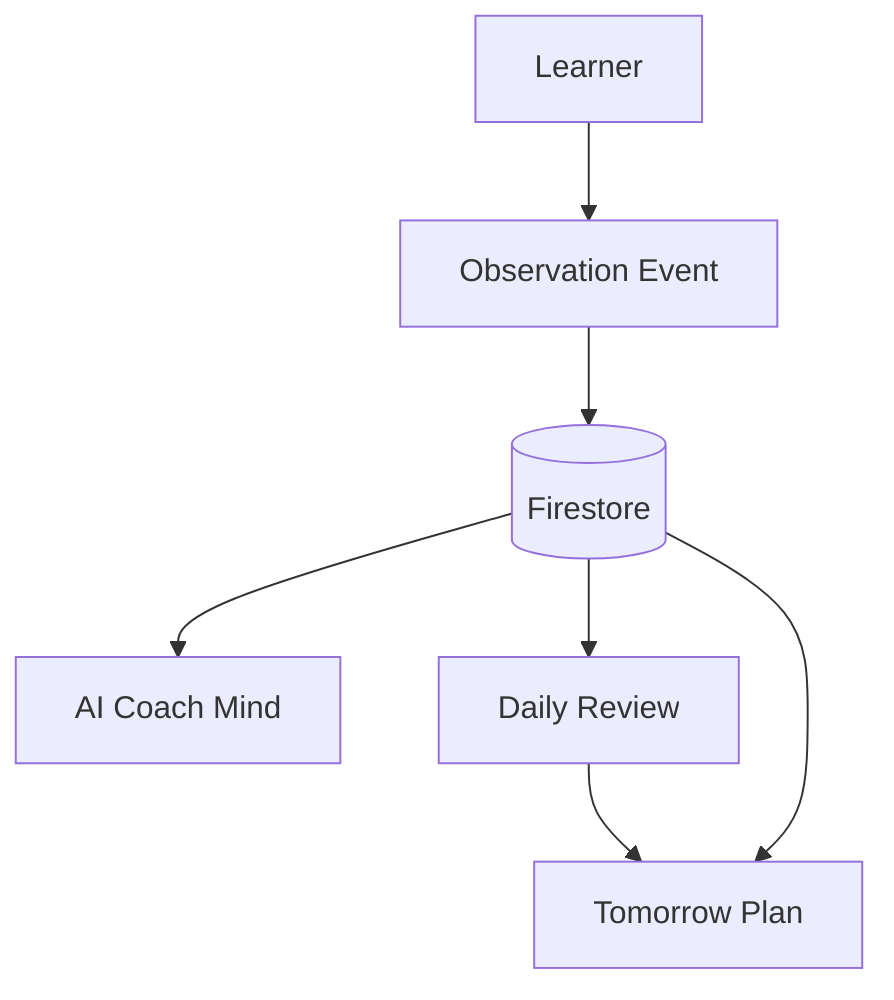

# MentorHQ

MentorHQ は、Observation を中心に設計された AI Learning Architecture です。  
学習者とのやり取りを `Observation Event` として保存し、その保存済み Observation を Firestore から読み直して、AI の思考を毎回再生成します。

## Architecture



### 全体の流れ

1. 学習者が肢ごとに回答する
2. そのやり取りを `Observation Event` に変換する
3. Observation を Firestore に保存する
4. AI Coach Mind が保存済み Observation を読み、`Reading` `Memory` `Pattern` `Review` を生成する
5. Daily Review が Observation と Session Memory を読んで日次レビューを生成する
6. Tomorrow Plan が Daily Review と Observation と Session Memory を読んで翌日の計画を生成する

### 何を永続化するか

- 学習進捗の中核となる永続データは `observation_events`
- `daily_reviews` と `tomorrow_plans` は生成結果として保存する
- Live Thought Stream 自体は保存しない
- AI の発話は資産として保持せず、保存済み Observation から毎回再生成する

## Observation First Design

MentorHQ は次の分離を採用しています。

- `Observation = Fact`
- `AI Coach Mind = Hypothesis`

保存するのは学習者側の観測事実です。たとえば:

- どの肢をどう判断したか
- 正誤
- 実際に存在した学習者質問
- その他の観測済みセッション事実

保存しないのは AI の思考です。たとえば:

- `Reading`
- `Memory`
- `Pattern`
- `Review`

これらは保存済み Observation を元に、Gemini がその都度再生成します。

### なぜこの設計なのか

- モデル改善をそのまま新しい Thought に反映できる
- プロンプト改善をそのまま新しい Thought に反映できる
- AI の発言を資産化しない
- 長期的に価値が残る Fact を資産化する

要するに、MentorHQ は

- Fact を保存する
- Thought は再生成する

という設計を採用しています。

## AI Design

### AI Coach Mind

AI Coach Mind は、Observation 履歴を読んで 4 つの短い内部思考を生成するランタイム層です。

- `Reading`: 今回何が起きたか
- `Memory`: 前回から何が変わったか
- `Pattern`: この人はどう学ぶタイプか
- `Review`: 今日何を持ち帰るか

これらの turn は `/api/coach-mind` を通じて Gemini で生成されます。

現在の実装では、次の制約を強くかけています。

- 観測されていない absence を evidence として扱わない
- チャットが渡されていないことを「質問しなかった」と言わない
- 理由入力が無いことを「理由がなかった」と言わない
- `Pattern` は学習者モデルだけを更新し、現在の法領域や条文や肢そのものは分析しない

### Live Thought Stream

Live Thought Stream は Firestore に保存しません。

現在の実装フローは次のとおりです。

1. React が `/api/daily-session/latest` から最新の daily session を取得する
2. その API が Firestore から `observation_events` を読み込む
3. React がその Observation を `observations` state に同期する
4. 各 Observation ごとにクライアントが `/api/coach-mind` を呼ぶ
5. Gemini が `Reading` `Memory` `Pattern` `Review` を再生成する

つまり Live Thought Stream はキャッシュではなく再生成です。

ページを再読み込みした場合も:

- Observation は Firestore から再取得できる
- Thought はその Observation を元に再計算される
- 以前の Thought 文面そのものは DB から復元しない

## Data Flow

### Learner から Observation へ

学習者は statement 単位で回答します。  
そのやり取りは `Observation Event` に変換され、主に次の情報を持ちます。

- `question_id`
- `question_index`
- `statement_index`
- `learner_choice`
- `correct_or_wrong`
- `observation_note`
- `note`

不正解後チャットが存在する場合は、その transcript が `note` に観測事実として保存され、後から AI Coach Mind が読むことができます。

### Observation から Live Thought Stream へ

`/api/coach-mind` 自体は Firestore を直接読んでいません。  
この API はクライアントから次を受け取ります。

- `latestObservation`
- `recentObservations`
- `existingThoughts`

これらは React state 由来ですが、その state 自体は Firestore から読み込まれた `observation_events` を含む API レスポンスで hydrate されています。

### Observation から Daily Review へ

Daily Review の生成では次を読みます。

- `observation_events`
- `sessions` 由来の memory summary

そのうえで Daily Review を生成し、保存するのは生成結果だけです。

### Observation から Tomorrow Plan へ

Tomorrow Plan の生成では次を読みます。

- `daily_reviews`
- `observation_events`
- `sessions` 由来の memory summary

そのうえで Tomorrow Plan を生成し、保存するのは生成結果だけです。

## Firestore

現在の実装では、次のコレクションを使用しています。

### `sessions`

deliberation レベルの Session Memory を保存します。

主な内容:

- `learnerCase`
- `deliberation_events`
- `coach_decision`
- `misunderstanding_type`
- `mode`
- `created_at`

これは memory context や repeated-pattern summary の元データとして使われます。

### `daily_sessions`

1 日の学習セッション本体を保存します。

主な内容:

- `question_ids`
- `current_index`
- `observation_count`
- `status`
- `review_status`
- `tomorrow_plan_status`
- `created_at`

### `observation_events`

学習者進捗の観測事実を保存します。

主な内容:

- `daily_session_id`
- `question_id`
- `question_index`
- `statement_index`
- `learner_choice`
- `correct_or_wrong`
- `learner_reason`
- `reasoning_style`
- `intervention_type`
- `misunderstanding_type`
- `answer_signal_score`
- `observation_note`
- `note`
- `created_at`

このコレクションが Live Thought Stream、Daily Review、Tomorrow Plan の主要な Fact source です。

### `daily_reviews`

生成済み Daily Review を保存します。

主な内容:

- `daily_session_id`
- `summary`
- `key_observations`
- `repeated_patterns`
- `coach_comment`
- `created_at`

### `tomorrow_plans`

生成済み Tomorrow Plan を保存します。

主な内容:

- `daily_session_id`
- `daily_review_id`
- `focus_theme`
- `practice_items`
- `caution_points`
- `coach_message`
- `created_at`

## Storage Model

### Firestore

本番系の永続保存先です。

- `sessions`
- `daily_sessions`
- `observation_events`
- `daily_reviews`
- `tomorrow_plans`

### React Local State

画面表示とランタイム制御のためにだけ使います。

例:

- `observations`
- `latestObservation`
- `coachMindTurns`
- `dailyReview`
- `tomorrowPlan`

これは永続保存ではありません。

### localStorage

現在の実装では使っていません。

### sessionStorage

現在の実装では使っていません。

### Fallback Storage

Firestore が使えない場合、サーバー側では次にフォールバックします。

- in-memory maps
- `/tmp` 配下の JSON ファイル

現在の fallback file:

- `mentorhq-daily-sessions.json`
- `mentorhq-observation-events.json`
- `mentorhq-daily-reviews.json`
- `mentorhq-tomorrow-plans.json`

## 何を保存し、何を再計算するか

### 保存するもの

- Observation
- daily session metadata
- deliberation session memory
- generated daily reviews
- generated tomorrow plans

### 再計算するもの

- Live Thought Stream
- `Reading`
- `Memory`
- `Pattern`
- `Review`

これが MentorHQ の中核設計です。

- Fact は保存する
- Thought は再生成する

## Run

```bash
npm install
cp .env.example .env.local
npm run dev
```

[http://localhost:3000](http://localhost:3000) を開いてください。

Firestore credential が無い場合は、アプリは in-memory と `/tmp` ストレージにフォールバックします。
